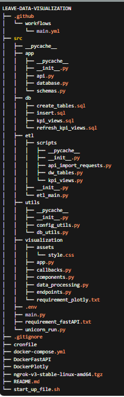
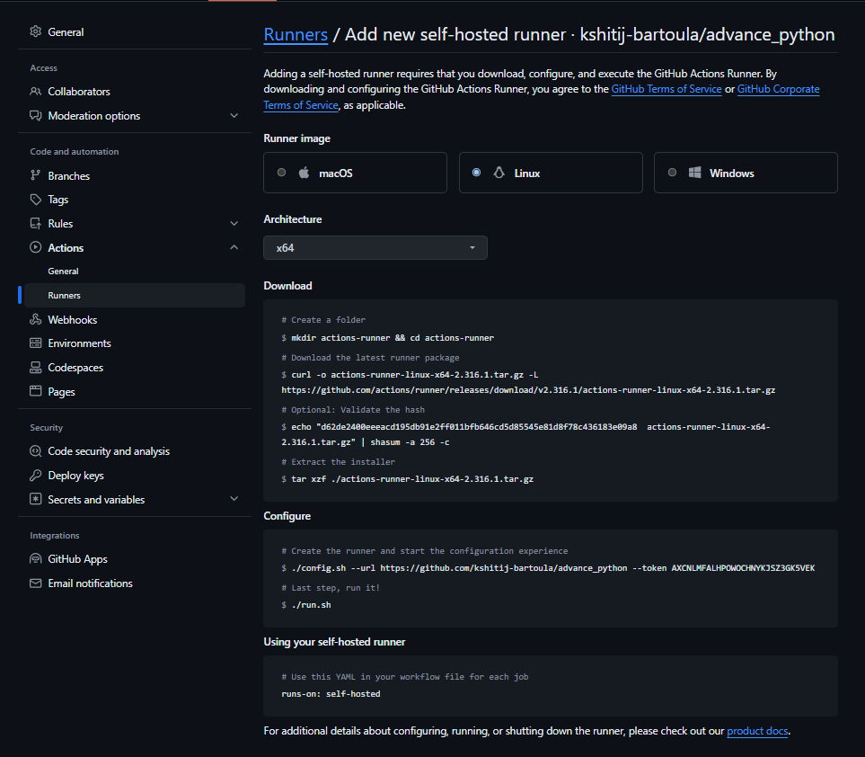

LEAVE VISUALIZATION SYSTEM

This repository contains an end-to-end ETL (Extract, Transform, Load) pipeline for extracting leave data from the Vyaguta API, transforming it, loading it into a PostgreSQL data warehouse, and generating insights using different KPI metrices. The generated KPI's are forwarded to fastApi endpoints which are visualized through Plotly Dash. The application is containerized using Docker and ci/cd has been implemented using Github actions.

FOLDER STRUCTURE

OVERVIEW :

DB CONFIG OVERVIEW:
  The DB credentials and api credentials are stored in Github Secrets and passed while creating docker container. The secrets are forwarded as gitenv vaiables in .github/workflows main.yml and then passed into docker-compose.yml as variables. Those credentials are then passed to config.utils.py and db_utils.py (src/utils folder) to establish connection with PostgreSQL database.

ETL PIPELINE OVERVIEW :

Data Extraction: The main script that carries out the extraction is main.py located in the src/etl/ folder. There are three other etl scripts from (src/etl/scripts) that executes when we run main.py to complete the whole etl process for the project:

1. api_import_requests.py : The script is use to fetch api data from the provided api url and parse those data and populate the parsed data into raw schema of PostgreSQL database. The table created on raw schema are api_data and allocations.

2. dw_tables.py : The script checks the existance of dw schema on the database and creates schema if not exists. It populates data into different tables dimension and fact of dw schema. For this there two files from src/db : create_tables.sql and insert.sql which are executed inside this script to create and populate data on dw schema tables. The table created are: employee_details, leave_type, fiscal_detail, allocations and fact_table.

3. kpi_views.py : The scripts is used to create the materialized views which which are responsible to provide different meaningful insights from the available leave data from dw schema. The script will execute two files from src/db folder (kpi_views.sql and refresh_kpi_view.sql). There are various kpi created using this script.

  The main.py file will execute all these three scripts. Aditionally the main.py is configured to execute every 2 minutes using cronjob schedule so that we could acheive real time visualization.

FAST API OVERVIEW:

1. database.py: Fast api will establish connection with database with the help of database.py (src/app folder) which eventually calls utils/db_utils for setting up connection.

2. schema.py : This file will help to provide response model for the output format of the different API endpoints exposed by fast api.

3. api.py : This file is used to create endpoint for individual kpi created in PostgresSql DW schema and transfer the database result into serialize objects.

4. main.py : It serves as the main entry point for the FastAPI application. It initializes the FastAPI app and includes the API routers.

5. uvicorn_run.py : This file contains the script to run the FastAPI application using Uvicorn, an ASGI server. It defines a function to start the server and can be executed to launch the application.

PLOTLY DASH OVERVIEW:

The visualization code is maintained under src/visualization folder.

1. enpoints.py: All the endpoints exposed by fast api has been mapped into enpoints.py.

2. data_processing.py : It will request to fetch data from thse exposed Fast api endpionts.

3. components.py : It is used to define reusable components of the web application, such as charts, graphs, buttons, and other UI elements. These components can be imported and used in different parts of the application to maintain consistency and modularity.

4. callback.py : It contains callback functions that handle user interactions within the web application. Callbacks are used to update the UI dynamically based on user inputs, making the application interactive.

5. app.py : This is the main entry point for the visualization application. It typically initializes the web server, sets up the routes, and starts the application. This file often integrates different components and functionalities provided by other modules.

DOCKERIZATION: The entire pipeline is containerized using Docker, including services like Fast api, PostgreSQL, and Plotly Dash.

CI/CD : For ci/cd , github avctions workflow has been used which is self hosted and deploys the code to a local environment using Docker Compose whenever changes are pushed to the main branch.

RUN LOCALLY

To run the project locally. You need to have installed :
Docker

Clone the project:
https://github.com/kshitij-bartoula/leave-data-visualization.git

Add these secrets in Github secrets:
    DB_USERNAME
    DB_PASSWORD
    DB_HOST
    DB_NAME
    BEARER_TOKEN
    API_ENDPOINT

You should have enabled local runner in your machine. Here is the screenshshot from github repository setting -> action -> runner on how you could set up local runner from github repository setting into your local machine. You need to download local runner outside of you project folder as it is mainly related to transforming your local machine into self hosting server.

Once these 3 steps are completed any push on main branch of github will run workflow which will run docker compose down , build and up command to create image based on latest code pushed on main branch. This will enable all three services PostgreSql, fast api and plotly Dash.

You can access:
 fast api on http://localhost:8000/ and on  http://localhost:8000/docs which will open fast api swagger that make easier for testing fast api endpionts.
 plotly Dash on http://localhost:8050/
